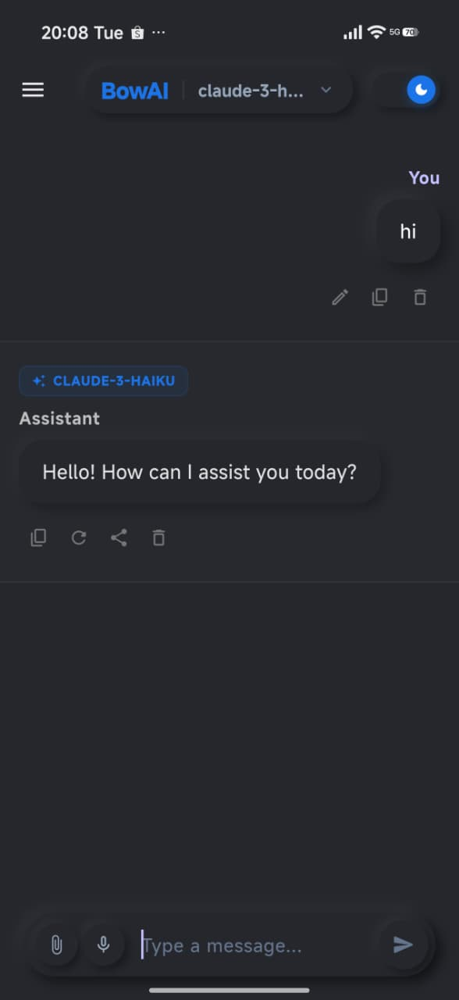
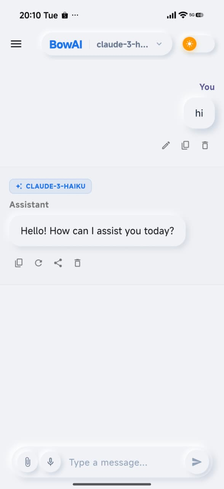

# BowAI

[](https://flutter.dev)
[](https://dart.dev)
[](https://openrouter.ai/)
[]()

A modern, feature-rich Flutter chat application that gives you a beautiful, intuitive interface to converse with a wide range of AI models—all powered by a single OpenRouter API key.

---

##  Screenshots

*Drag and drop your screenshots here, or upload them to an `assets/screenshots/` folder and reference them directly.*

| Dark Mode Chat | Light Mode Conversation |
|:---------------:|:----------------------:|
|  |  |


> **Tip:** Animated GIFs work great for showing the theme switcher or voice input in action.

---

## ✨ Key Features

###  Unlimited AI Model Access
* **22 Free Models** – Switch between the latest models from OpenAI, Anthropic, Google, and more.
* **One API Key** – All models are routed through [OpenRouter](https://openrouter.ai/), so you only need a single key.
* **Model‑specific personality** – Different models shine in different tasks: coding, creative writing, reasoning, etc.

###  Multimodal Input
* **Images** – Send photos and have the AI describe, analyse, or answer questions about them.
* **Documents** – Upload PDF, DOCX, or PPTX files; the app extracts the text so you can discuss the content.
* **Voice** – Tap the microphone and speak your prompt—your words appear in the chat instantly.

###  Beautiful, Responsive UI
* **Neumorphism Design** – Soft shadows and clean, modern aesthetics (v2.0.1).
* **Material 3** – Fully adaptive layout that looks great on phones, tablets, and desktops.
* **Rich Text Rendering** – AI responses are rendered with full Markdown support, including syntax‑highlighted code blocks.

###  Conversation Management
* **Auto‑Save** – Every chat is persisted locally, so you never lose context.
* **Load & Continue** – Pick up any previous conversation right where you left off.
* **Organise** – Rename or delete sessions to keep your workspace tidy.

###  Dynamic Theming
* **Light ↔ Dark** – Toggle with one tap; your preference is saved and applied automatically on next launch.
* **Google Fonts** – Modern typography that scales beautifully across all platforms.

---

## ️ Tech Stack & Dependencies

| Category | Technology / Package | Purpose |
|---------|----------------------|---------|
| **Framework** | [Flutter](https://flutter.dev/) (≥3.11.5) | Cross‑platform app development |
| **Language** | Dart 3.x | Core programming language |
| **HTTP** | `http` | All network calls to the OpenRouter API |
| **Markdown** | `flutter_markdown`, `markdown` | Rich text & code‑block rendering |
| **Voice** | `speech_to_text` | Speech recognition (voice input) |
| **Document Parsing** | `syncfusion_flutter_pdf`, `archive` | Extract text from PDF, DOCX, PPTX |
| **File Picking** | `file_selector` | Cross‑platform file & image selection |
| **Persistence** | `shared_preferences` | Store theme preference & conversation history |
| **Environment** | `flutter_dotenv` | Secure API key management |
| **Typography** | `google_fonts` | Modern, cross‑platform font support |

---

##  Project Structure

```
lib/
├── main.dart                       # App entry point & theme setup
├── models/
│   └── chat_message.dart           # Chat message data model
├── screens/
│   └── chat_screen.dart            # Main chat UI & interaction logic
├── services/
│   ├── conversation_service.dart   # Local save/load of chat history
│   ├── document_parser_service.dart# Text extraction from uploaded files
│   ├── openrouter_service.dart     # OpenRouter API integration
│   └── theme_service.dart          # Light/dark mode state management
└── widgets/
    └── chat_message_widget.dart    # Reusable message bubble component
```

---

## ⚙️ Getting Started

Follow these steps to run BowAI on your local machine.

### Prerequisites
* Flutter SDK ≥3.11.5 ([install guide](https://docs.flutter.dev/get-started/install))
* An [OpenRouter API key](https://openrouter.ai/keys) (free tier available)

### 1. Clone the Repository
```bash
git clone https://github.com/amblackpearl/bow_ai.git
cd bow_ai
```

### 2. Install Dependencies
```bash
flutter pub get
```

### 3. Configure Environment
Create a `.env` file in the project root:
```env
OPENROUTER_API_KEY=your_api_key_here
```
> Never commit `.env` to version control—it’s already listed in `.gitignore`.

### 4. Run the App
```bash
flutter run
```
> **Linux desktop users:** ensure you have `clang`, `cmake`, `ninja‑build`, and `gtk‑3` development headers installed (see the [Flutter Linux requirements](https://docs.flutter.dev/get-started/install/linux)).

---

##  Platform Support

| Platform | Status | Notes |
|----------|:------:|-------|
| Android | ✅ Full | APKs available on the [Releases](https://github.com/amblackpearl/bow_ai/releases) page |
| Web | ✅ Full | Build with `flutter build web` |
| Linux | ✅ Full | Tested on Ubuntu 22.04+ |
| iOS | ⚠️ Untested | Should work; macOS build environment required |
| Windows | ⚠️ Untested | Visual Studio build tools required |
| macOS | ⚠️ Untested | Xcode required |

---

##  Latest Release: v2.0.1

**What’s New (2026‑04‑28)**
*   Added 22 free AI models via OpenRouter.
*   Redesigned UI with Neumorphism styling.
*   Voice recognition (speech‑to‑text).
*   Media picker for images.
*   Fixed chat history persistence.
*   Full English localisation.

[Download APKs](https://github.com/amblackpearl/bow_ai/releases/tag/v2.0.1) | [Full Changelog](https://github.com/amblackpearl/bow_ai/releases)

---

##  Known Quirks
*   **No App Icon** – intentionally minimal; you’re welcome to add your own.
*   **Unsigned APK** – First install may trigger a Google Play Protect warning. Just tap *Install anyway*.


---

##  Contributing

Pull requests are welcome! If you’d like to add a feature or fix a bug:
1. Fork the repository.
2. Create a feature branch (`git checkout -b feature/amazing-idea`).
3. Commit your changes (`git commit -m 'Add amazing idea'`).
4. Push to the branch (`git push origin feature/amazing-idea`).
5. Open a Pull Request.

---

##  License

This project is open source and available under the [MIT License](LICENSE) (or provide the actual license file if different).

---

##  Author

**Priyo Adi Wibowo** ([@amblackpearl](https://github.com/amblackpearl))

---

*Built with Flutter and a love for clean, AI‑powered interfaces.*
